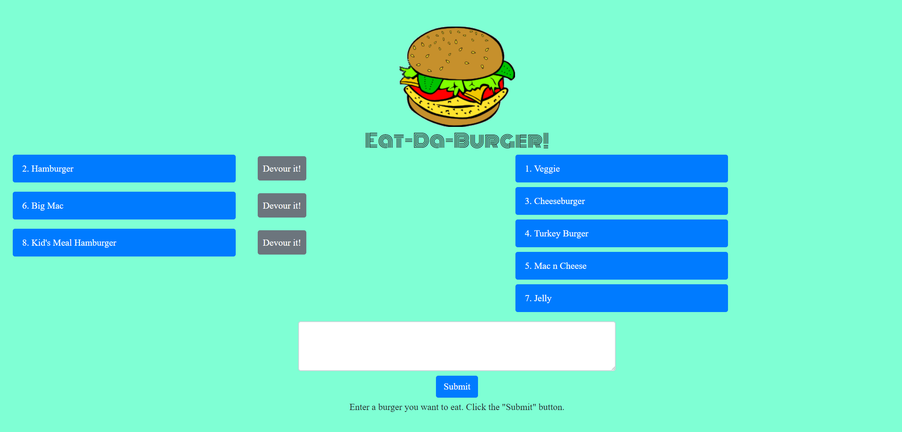

# burger

## Eat-Da-Burger App

* Created a burger logger:
    * Burgers in the database that have not been devoured, show in the left column with a **Devour it!** button.
    * When the **Devour it!** button has been selected for a burger, it gets moved to the right column, with the rest of the devoured bugers.  
    * You can add more burgers to the list to devour by typing in the **burger name** and clicking **submit**.  

### Results:

 Created with **MySQL**, **Node**, **Express**, **Handlebars** and a homemade **ORM**. Followed the **MVC** design pattern; used **Node** and **MySQL** to query and route data in the app, and **Handlebars** to generate the HTML.

 

