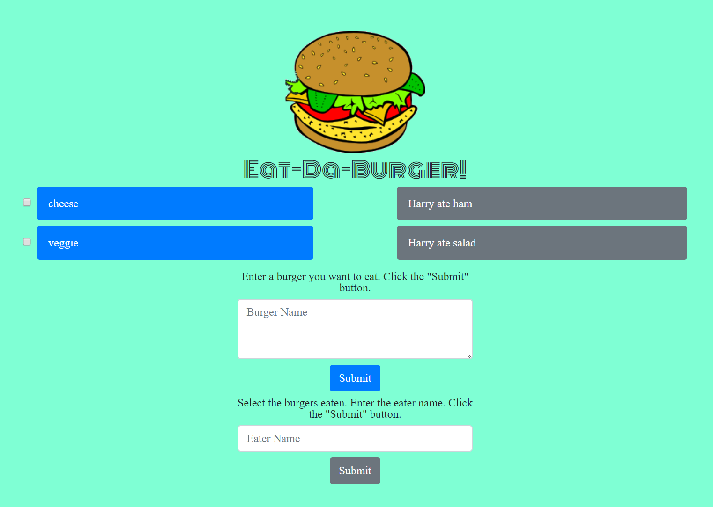

[Eat-Da-Burger App](https://limitless-shore-94832.herokuapp.com/)

# sequelizedBurger

## Eat-Da-Burger App

* Created a burger logger:
    * Burgers in the database that have not been devoured, show in the left column with a checkbox next to it.
    * Burgers appear in alphabetical order by name.
    * When eaten, select the burger(s), type in the **eater name** and click the **Submit** button.  The burger(s) gets moved to the right column, with the rest of the devoured bugers and the name of the person who ate the burger is shown.
    * You can add more burgers to the list to devour by typing in the **burger name** and clicking **Submit**.  

### Results:

 Created with **MySQL**, **Node**, **Express**, **Handlebars** and **Sequelize**. Used **Node** and **Sequelize** to query and route data in the app, and **Handlebars** to generate the HTML.  Responsive **Bootstrap** web design.  

 

